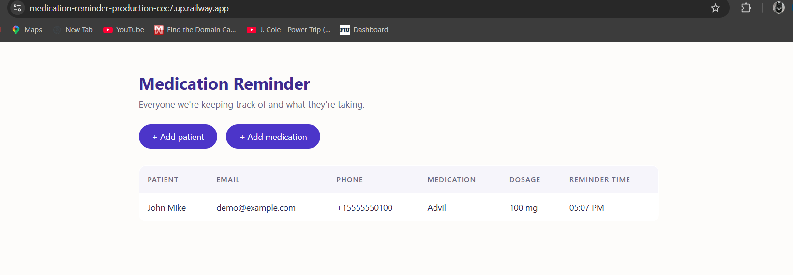
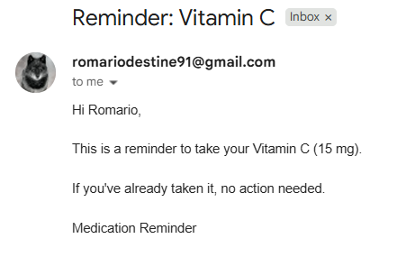

# Medication Reminder

**[Live Demo](https://medication-reminder-production-cec7.up.railway.app)** · Flask · MySQL · Twilio

A Flask app that checks who needs to take what, and actually tells them — by email and SMS.

Built it because reminder apps assume the person needing reminding is the one holding the phone. That's often not true. This one lets someone else manage the schedule while the patient just gets a message.

## What it does

- Stores patients and their medication schedules in MySQL
- Runs on a schedule, finds anything due that minute, and sends a reminder
- Emails via `smtplib`, texts via Twilio
- Logs every send so nobody gets the same reminder twice
- Web forms for adding patients and meds, so you never touch SQL

<!-- screenshots go here -->



## Quick start

```bash
git clone https://github.com/Lilmario1/Medication-Reminder.git
cd Medication-Reminder
pip install -r requirements.txt
mysql -u root -p < schema.sql
```

Create a `.env`:

```
DB_HOST=localhost
DB_USER=root
DB_PASSWORD=
DB_NAME=medication_reminder

EMAIL_ADDRESS=
EMAIL_PASSWORD=

TWILIO_SID=
TWILIO_TOKEN=
TWILIO_NUMBER=
```

Gmail needs an [App Password](https://myaccount.google.com/apppasswords), not your account password — 2-Step Verification has to be on first.

```bash
python app.py        # web interface on :5001
python reminder.py   # check and send
```

## How it works

`reminder.py` is the engine. It joins `patients` to `medications`, filters to the current `HH:MM`, and for each result checks the `reminders` table before sending anything:

```python
def try_send(med, method, send_func):
    if already_sent_today(med["id"], method):
        return
    try:
        send_func(med)
        log_reminder(med["id"], method, "sent")
    except Exception as e:
        log_reminder(med["id"], method, "failed")
```

Email and SMS are tracked separately, so a successful email doesn't block the text. Failures get logged too — useful when you want to know *why* someone never got their reminder.

`app.py` handles the web side: one route for the table, two for the add forms.

## Schema

Three tables:

- **patients** — name, email, phone
- **medications** — med name, dosage, reminder time, frequency, FK to patients
- **reminders** — what was sent, when, by which channel, and whether it worked

The `reminders` table is what makes this safe to run repeatedly. Without it the script has no memory and will happily spam someone.

## Known limitations

- **Twilio trial accounts can't send custom SMS text.** The `body` has to be one of Twilio's predefined templates, and you can only send to verified numbers. The integration works; the message content is theirs until you upgrade. Email has no such restriction.
- `reminder.py` only fires if it runs during the exact minute a med is due — it needs a cron job or scheduler to be useful in production.
- No auth. Anyone who can reach the app can see every patient.

## Next

- Scheduler so it runs on its own
- Login before this touches anyone's real data
- Edit and delete, not just add